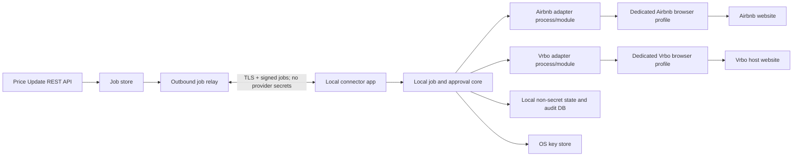

# Local Browser Adapter Proposal

## Status

**Proposed architecture, conditional on provider authorization.**

This design keeps Airbnb and Vrbo credentials, MFA, verification challenges, cookies, and browser storage on the user's computer. It does not, by itself, make browser automation permitted.

### United States: adapter-relevant prohibitions

The following provisions are the ones directly relevant to a browser adapter operated by a U.S. host as of August 1, 2026:

- **Airbnb — U.S.-applicable Terms of Service §11.1, “Airbnb Platform Rules”:** “Do not use bots, crawlers, scrapers, or other automated means … to otherwise interact with the Airbnb Platform.” Airbnb places U.S. users under its Terms for users outside the EEA, UK, and Australia. [Official Airbnb Terms](https://www.airbnb.com/help/article/2908)
- **Vrbo — U.S. Host Terms of Service §13.1.1, “Prohibitions”:** “Host shall not directly or indirectly … whether by using automatic devices or manual processes, exploit” Vrbo's service, site, content, or databases. Section 13.1.2 additionally prohibits automated instruments from monitoring service content, which is relevant to post-save price verification. [Official Vrbo U.S. Host Terms](https://www.vrbo.com/lp/b/host-terms-of-service?preferlocale=true&siteid=9001001)

Applied to the requested adapters, automated navigation, DOM inspection, clicking, price-field entry, saving, and post-save verification would use automated means to interact with or operate against the provider sites. Treating those actions as covered by the clauses above is a conservative interpretation, not legal advice; provider authorization or U.S. counsel should resolve it before launch.

Accordingly, full automation must have a launch gate: **obtain written authorization from each provider, or a legal determination that the intended use is permitted, before enabling automated interaction in production.** Until then, the same application can run in a user-guided mode that presents the job and an isolated provider browser but leaves all provider interaction to the user.

## 1. Objective

Provide two separate local adapters:

1. `AirbnbBrowserAdapter`
2. `VrboBrowserAdapter`

Each adapter receives a signed price-update job from the Price Update Service, performs the update through a dedicated browser environment on the user's Windows or macOS computer, verifies the visible result, and returns a sanitized outcome. Platform passwords, MFA values, session cookies, browser databases, and page contents never go to the server.

## 2. Recommended product shape

Build one signed desktop companion application, **Property Management Codex Connector**, containing two separately versioned adapter modules. The application is distributed as:

- Windows: WinUI 3 application using WebView2, packaged as signed MSIX for Microsoft Store distribution.
- macOS: SwiftUI application using WKWebView, sandboxed and signed for Mac App Store distribution.

This native split is preferable to bundling a general Chromium automation runtime. It follows each store's browser-engine expectations, reduces the attack surface, and gives the application an OS-managed storage container. Microsoft supports distributing Win32 applications as MSIX through the Store; see [Microsoft Store desktop distribution](https://learn.microsoft.com/en-us/windows/apps/distribute-through-store/how-to-distribute-your-win32-app-through-microsoft-store). Apple creates a dedicated file container for sandboxed macOS applications; see [macOS App Sandbox containers](https://developer.apple.com/documentation/security/accessing-files-from-the-macos-app-sandbox).

The application must remain useful in guided mode so store review does not depend on reviewers having real Airbnb or Vrbo host accounts. Include a complete offline demo provider for store certification.

## 3. System architecture



### Trust boundary

The server is allowed to know:

- Internal customer and listing IDs.
- Requested dates, currency, and prices.
- Device public key, connector version, job status, and sanitized error codes.

The server is never allowed to receive:

- Airbnb or Vrbo usernames, passwords, passkeys, recovery codes, MFA values, or answers to verification questions.
- Cookies, bearer tokens, local storage, IndexedDB content, browser history, autofill values, or password-manager data.
- Raw HTML, network captures, console logs, or unredacted screenshots from provider pages.

Session cookies are credentials in practical security terms even if they are not passwords. They must remain inside the provider-specific browser data store and must never be exported, copied into the local application database, logged, synchronized, or backed up by the product.

## 4. Local identity and job transport

1. On first launch, the connector generates a device signing key and encryption key.
2. Private keys are non-exportable where supported and protected by Windows CNG/DPAPI or macOS Keychain/Secure Enclave. Only public keys are registered with the server.
3. The user pairs the connector with the Price Update Service using a short-lived code displayed in the authenticated web application.
4. The connector establishes an outbound-only TLS connection or long poll. It exposes no listening port on the user's network.
5. Every job is signed, addressed to one device, assigned a nonce and expiry, and constrained to the price-update schema. The connector rejects expired, replayed, malformed, or wrongly signed jobs.
6. Results are signed by the device and contain only normalized status data.

The server must not be able to send an arbitrary URL, JavaScript, selector, shell command, or file. Adapter code and locators ship only in signed store releases. Remote configuration is limited to non-executable feature flags, supported version ranges, and a kill switch.

## 5. Browser and storage isolation

### Windows

Use WebView2 with a custom user-data folder and a distinct profile for every provider/account pair. WebView2 explicitly supports separate storage for cookies, permissions, IndexedDB, cache, and other browser data through user-data folders and profiles; see [WebView2 user-data folders](https://learn.microsoft.com/en-us/microsoft-edge/webview2/concepts/user-data-folder).

Conceptual local layout:

```text
%LOCALAPPDATA%\PropertyManagementCodex\
  profiles\
    airbnb\<account-hash>\
    vrbo\<account-hash>\
  state\connector.sqlite
  logs\
```

The connector never points WebView2 at an Edge or Chrome user-data directory.

### macOS

Use WKWebView with a unique persistent `WKWebsiteDataStore` identifier for every provider/account pair. Apple documents both uniquely identified persistent stores and nonpersistent stores; see [WKWebsiteDataStore](https://developer.apple.com/documentation/webkit/wkwebsitedatastore).

All files remain in the application's sandbox container. The connector never reads Safari profiles, cookies, history, Keychain items belonging to Safari, or another browser's files.

### Common controls

- Separate Airbnb and Vrbo browser stores even when the same email address is used.
- Separate accounts within a provider; never share cookies across accounts.
- Disable browser password saving, general autofill, downloads, extensions, and developer tools in production.
- Exclude session-profile folders from product cloud sync and application-level backup.
- Offer `Sign out`, `Clear provider session`, and `Delete all local connector data` controls.
- Provide an optional ephemeral-session mode that deletes the profile at sign-out or application exit; this requires login and MFA on the next run.
- Never import cookies or credentials from existing browsers.

## 6. Authentication and verification flow

```mermaid
sequenceDiagram
  participant U as User
  participant C as Connector
  participant W as Isolated provider WebView
  participant P as Airbnb or Vrbo
  participant S as Price Update Service

  U->>C: Connect provider account
  C->>W: Open provider login page
  U->>W: Enter credentials directly
  W->>P: Authenticate over provider HTTPS
  P-->>W: MFA, CAPTCHA, passkey, or verification
  U->>W: Complete verification locally
  P-->>W: Local authenticated session
  C-->>S: Provider connected; no cookie or credential
```

Rules:

- Never inject automation scripts on login, MFA, CAPTCHA, passkey, recovery, or identity-verification pages.
- Never inspect password fields, capture keystrokes, read clipboard contents, or instrument third-party identity-provider pages.
- When reauthentication or verification appears, automation pauses and raises a local notification. Only the user may continue it.
- Never solve, outsource, bypass, suppress, or programmatically replay CAPTCHA or MFA.
- Social login redirects are permitted only during the visible interactive login flow and must use an explicit domain allowlist.
- Authentication cannot be completed through a remote desktop controlled by the service.

## 7. Adapter contract

Both implementations conform to a narrow local interface:

```text
probeSession(accountRef) -> SessionState
resolveListing(internalListingId) -> LocalListingBinding
buildPlan(priceUpdateJob) -> UpdatePlan
requestApproval(updatePlan) -> Approval
execute(updatePlan, approval) -> ExecutionResult
verify(updatePlan) -> VerificationResult
disconnect(accountRef) -> void
```

The local listing binding contains the provider-specific listing identifier or navigation path and is stored only on the device. The server sends the internal listing ID; it cannot redirect an adapter to an arbitrary provider account or page.

## 8. Airbnb adapter

`AirbnbBrowserAdapter` owns only Airbnb domains, its listing bindings, and its isolated browser data store.

Authorized automation state machine:

1. Confirm the session is authenticated; otherwise pause for user login.
2. Navigate through the shipped, allowlisted host-calendar route.
3. Confirm the visible listing identity matches the local binding.
4. Normalize requested listing-local dates, currency, and nightly values.
5. Select the exact dates and enter the requested nightly prices.
6. Show a local preview of old/new values and request approval according to policy.
7. Submit through the visible UI.
8. Reload or revisit the same dates and verify displayed values.
9. Return per-date outcomes without HTML, cookies, or screenshots.

If navigation, labels, currency, listing identity, or confirmation behavior differs from the tested state machine, stop with `ADAPTER_UI_CHANGED`; never guess at a control.

## 9. Vrbo adapter

`VrboBrowserAdapter` owns only Vrbo host domains, its listing bindings, and its isolated browser data store.

Its state machine is independently versioned because Vrbo's dashboard, calendar, rate tools, and confirmation behavior differ from Airbnb:

1. Confirm the local Vrbo/Expedia Group session or pause for user verification.
2. Navigate to the bound property's rate/calendar tool.
3. Verify property identity, currency, date range, and whether another Vrbo pricing rule would override the requested values.
4. Enter nightly prices for the requested dates.
5. Present a local preview and obtain approval.
6. Save through the visible UI.
7. Reopen the affected dates and verify the effective displayed rates.
8. Return per-date results and an explicit warning when a seasonal rule, promotion, or rate-automation setting may alter the final traveler price.

The Vrbo adapter must not attempt to automate Expedia Group's Connectivity Partner Portal; its terms separately prohibit automated access without prior written consent.

## 10. Execution modes

### Guided mode — default before authorization

- The connector receives and displays a price job.
- It opens the appropriate isolated browser profile and shows a local checklist.
- The user performs all provider interactions and confirms completion.
- The connector records `user_reported_succeeded` rather than claiming machine verification.
- No DOM inspection, scripted clicking, or automatic data collection occurs.

### Authorized automation mode

- Enabled separately for Airbnb and Vrbo only after the authorization gate is recorded.
- The connector executes the fixed provider state machine.
- A local approval screen is required before the final save by default.
- Unattended execution is a separate explicit opt-in and should remain disabled unless provider authorization clearly permits it.

### Emergency safe mode

- A server-delivered, signed non-executable kill switch can disable job execution by adapter version.
- The connector remains able to show pending work and clear local sessions.
- Jobs expire rather than applying stale prices when a device has been offline.

## 11. Price-update safety

- Accept only fixed-precision currency values and provider-supported date ranges.
- Display listing, channel, local time zone, currency, every affected date, and old/new value before commit.
- Require a unique job ID and keep a local replay ledger.
- Serialize updates per provider account and listing.
- Cap dates per job and daily jobs per account; do not imitate humans, rotate proxies, spoof fingerprints, or employ stealth plugins.
- Stop on a CAPTCHA, security challenge, unexpected modal, unknown currency, missing listing, overlapping pending job, or ambiguous success response.
- Never retry an ambiguous submission automatically. Reopen and verify first; if still uncertain, request user review.
- Support a locally enforced maximum percentage/absolute price change requiring additional confirmation.
- Preserve partial results per date and channel.

## 12. Auditing and diagnostics

The server may receive:

```json
{
  "jobId": "pu_01K...",
  "deviceId": "device_01K...",
  "provider": "airbnb",
  "adapterVersion": "1.2.0",
  "status": "verified_succeeded",
  "dates": [
    { "date": "2026-09-01", "requested": "225.00", "observed": "225.00", "status": "verified" }
  ],
  "completedAt": "2026-08-01T21:30:00Z"
}
```

Diagnostics rules:

- Normal logs contain route/state names and error codes, not page text or URLs with sensitive query strings.
- Screenshots and HTML dumps are disabled by default and never uploaded automatically.
- A user may create a local diagnostic bundle after previewing redactions. Upload is a separate, informed action.
- Crash reporting strips WebView state, URLs, form values, cookies, headers, and page content.

## 13. Store distribution and updates

- All executable adapter logic ships inside signed application releases.
- Windows releases use MSIX signing and Microsoft Store updates.
- macOS releases use App Sandbox, Hardened Runtime where applicable, and Mac App Store updates.
- No self-updater, downloaded executable, remote JavaScript bundle, browser extension, accessibility automation, or system-wide browser hook.
- Store metadata must clearly disclose that the app opens third-party host dashboards, keeps isolated local sessions, and does not represent endorsement by Airbnb or Vrbo.
- Do not use Airbnb or Vrbo trademarks in the app name/icon without permission.
- Treat store acceptance as uncertain until provider permission is documented; Apple's third-party-services rule makes this especially important.

## 14. Threat model and controls

| Threat | Primary control |
|---|---|
| Server breach exposes provider accounts | No provider credentials/session material on server |
| Malicious job turns connector into remote browser | Fixed schema, signed jobs, domain/route allowlist, no arbitrary script/URL |
| Cookie theft from another browser | Dedicated app data stores; no profile import or filesystem access to other browsers |
| Cross-provider session leakage | Separate stores and adapter ownership boundaries |
| Local malware reads sessions | OS sandbox/container, least privilege, disk encryption guidance, session-clear control |
| Stolen/replayed update | Device-bound signature, nonce, expiry, local replay ledger |
| UI change writes wrong field | State assertions, preview, fail closed, post-save verification |
| CAPTCHA/MFA bypass | Mandatory pause and local user completion only |
| Support bundle leaks secrets | Local-only by default, redaction preview, explicit upload consent |
| Compromised remote configuration | No remote executable selectors/scripts; signed store releases only |

## 15. MVP delivery plan

### Phase 0 — authorization and prototype gate

- Request written automation permission from Airbnb and Vrbo.
- Confirm target host-account types, regions, login methods, and store-distribution rights.
- Build disposable proof-of-concept state machines against test accounts only.
- Validate whether WKWebView/WebView2 behavior is accepted by provider authentication systems.

### Phase 1 — secure connector foundation

- Device pairing and OS-protected keys.
- Signed/expiring job transport, local replay protection, approval UI, local audit DB, and demo provider.
- Windows and macOS isolated profile lifecycle.
- Guided mode for both providers.

### Phase 2 — separate adapters

- Airbnb adapter, listing binding, preview, update, and verification.
- Vrbo adapter, listing binding, rule-conflict detection, preview, update, and verification.
- Contract, state-machine, accessibility, and failure-injection tests.

### Phase 3 — controlled pilot

- One device, one account, and one test listing per provider.
- Small future price changes, mandatory local approval, and manual cross-check.
- Validate session expiration, MFA, CAPTCHA, UI changes, network loss, ambiguous saves, and rollback procedure.

### Phase 4 — store release

- Privacy disclosures, demo mode, code signing, store review notes, support/runbooks, staged rollout, and per-adapter kill switch.

## 16. Acceptance criteria

- No provider password, MFA value, cookie, token, browser database, page capture, or raw provider response reaches the server in security and network tests.
- The connector does not read or modify any existing Chrome, Edge, Safari, Firefox, or other browser profile.
- Airbnb and Vrbo sessions remain isolated from each other and between accounts.
- Login and every verification challenge are visibly completed on the user's device.
- A job cannot carry an arbitrary URL, selector, script, command, or executable payload.
- Every job requires local approval unless an explicitly authorized unattended policy is enabled.
- Unknown UI, ambiguous save, security challenge, or mismatched listing fails closed.
- Verification reports reflect the displayed post-save value and never claim success solely because a click completed.
- Clearing a provider session removes its cookies and site data without affecting another provider or an installed browser.
- Both store packages are signed, sandboxed appropriately, and update only through their approved release channel.
- Written provider authorization or approved legal sign-off exists before automated production operation is enabled.

## 17. Decisions required

1. Will written browser-automation permission be sought from Airbnb and Vrbo, and who owns that process?
2. Is guided mode useful while authorization is pending?
3. Must updates run unattended, or is local approval acceptable for every batch?
4. Should sessions persist locally, or should the user authenticate for every run?
5. Can one listing be managed from more than one user device, and which device wins?
6. Should provider listing mappings stay only on the device, as recommended, or also be visible to the server?
7. What maximum price change and date count require enhanced confirmation?
8. Are Windows and macOS both required for the MVP, or should Windows ship first?

## Recommendation

Build the local connector foundation and guided mode first. Keep the Airbnb and Vrbo adapters separate in code, storage, release compatibility, and operational kill switches. Prototype full automation only with designated test accounts, and do not enable it for production until the relevant provider has granted written permission or qualified counsel has approved the intended use.

This approach satisfies the credential-locality and browser-isolation goals while making the non-technical platform risk an explicit, testable launch condition.
