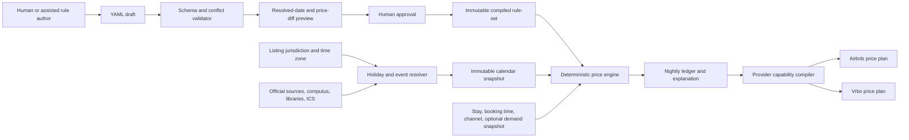

# Price Engine Proposal

## Status

**Implemented design. See the [price-engine package README](../../packages/price-engine/README.md) and [pricing API README](../../services/pricing-api/README.md) for the current browser and local-service entry points.**

The engine should accept human-readable, declarative rules; resolve holidays and events from the listing's jurisdiction; calculate an explainable price for every accommodation night; calculate stay-dependent discounts for a complete date range; and compile only provider-supported changes for the Airbnb and Vrbo adapters.

The core recommendation is:

1. Use a small pricing-specific YAML rule format as the authoring format.
2. Validate it with [JSON Schema 2020-12](https://json-schema.org/draft/2020-12) and compile it to an immutable typed model.
3. Use a separate, versioned Holiday and Event Calendar service.
4. Evaluate prices deterministically with fixed-precision arithmetic and a complete rule trace.
5. Treat natural language as an assisted authoring input, never as the executable production rule.
6. Compile results through a channel-capability layer; never approximate an unsupported Airbnb or Vrbo rule silently.

## 1. Why a pricing-specific rule format

There is no broadly adopted vacation-rental pricing-rule standard. Several established standards and open implementations are useful building blocks:

| Option | Useful characteristics | Limitation for this project | Decision |
|---|---|---|---|
| [CEL](https://cel.dev/overview/cel-overview) | Typed, embeddable, mutation-free, non-Turing-complete expressions that can be compiled before evaluation | It supplies expressions, not pricing stages, priorities, event resolution, or explanations | Optional advanced-condition language |
| [OMG DMN/FEEL 1.5](https://www.omg.org/spec/DMN/1.5/About-DMN) | Formal business-decision standard, decision tables, dates, ranges, and defined hit policies | XML and full DMN tooling are unnecessarily heavy for the MVP | Consider future import/export and analyst tables |
| [JsonLogic](https://jsonlogic.com/) | Serializable JSON rules with implementations for multiple runtimes | Raw JSON is poor for human editing and it has no first-class holiday/event model | Useful design reference, not the authoring format |
| [GoRules Zen](https://github.com/gorules/zen) | MIT-licensed, cross-platform decision tables and JSON Decision Models | A general decision graph adds complexity without solving pricing/calendar semantics | Possible future visual editor, not required initially |
| [OPA/Rego](https://www.openpolicyagent.org/docs/policy-language) | Strong policy-as-code ecosystem and decision logs | Better suited to authorization and guardrails than ordered price arithmetic | Suitable for service authorization, not core pricing |
| Drools | Mature agenda and inference engine | Mutable actions, salience, and agenda behavior are harder to make transparent and deterministic | Do not use for the MVP |

The industry products point to the domain features the rule language should support:

- Airbnb professional rule-sets support nightly changes, length-of-stay discounts, early-bird and last-minute discounts, minimum/maximum stays, and check-in/out restrictions. Airbnb documents the order as nightly/weekend pricing, then length-of-stay discount, then booking-window discount. [Airbnb rule-set documentation](https://www.airbnb.com/help/article/2061)
- Vrbo supports a base rate by weekday, weekly/monthly extended-stay discounts, and date-specific rate or discount overrides. [Vrbo rate documentation](https://help.vrbo.com/articles/How-do-I-manage-my-rates)
- PriceLabs exposes seasonal minimum/base/maximum prices, date-specific overrides, day-of-week changes, last-minute/far-out pricing, occupancy adjustments, orphan gaps, and minimum-stay profiles. [PriceLabs seasonal pricing](https://help.pricelabs.co/portal/en/kb/articles/seasonal-minimum-base-and-max-price-settings)

Those products also demonstrate why provider semantics must remain outside the rule engine. For example, Airbnb may choose the larger of overlapping length-of-stay and booking-window discounts, while Vrbo documents that a weekly/monthly discount can stack with one promotion. [Airbnb calculation order](https://www.airbnb.com/help/article/2061), [Vrbo promotion stacking](https://help.vrbo.com/articles/About-promotions)

## 2. Proposed human-readable rule format

YAML is the editable representation; the stored canonical representation is normalized JSON. Dates use unambiguous ISO `YYYY-MM-DD` notation. The first version deliberately supports typed selectors and actions instead of arbitrary executable code.

```yaml
schema: pmc.price-rules/v1

rule_set:
  id: copacabana-house
  version: 7
  effective_from: 2026-09-01

listing_context:
  currency: BRL
  timezone: America/Sao_Paulo
  jurisdiction:
    country: BR
    subdivision: BR-RJ
    municipality: IBGE:3304557

base:
  weekday: "2020.00"
  weekend: "2302.00"
  weekend_days: [fri, sat]

rules:
  - id: low-season
    name: Low season discount
    layer: season
    group: annual-season
    priority: 100
    stacking: exclusive
    when:
      annually:
        from: "05-15"
        through: "06-30"
    apply:
      adjust_nightly_percent: "-10"

  - id: carnival
    name: Rio Carnival
    layer: event
    group: major-event
    priority: 900
    stacking: exclusive
    when:
      event:
        key: br.rj.rio.carnival
        days_before: 2
        days_after: 1
        accepted_status: [confirmed, calculated]
    apply:
      set_final_nightly: "5200.00"
      minimum_stay: 6
    suppresses: [annual-season, length-of-stay]

  - id: carnival-prime
    name: Rio Carnival prime nights
    layer: event
    group: major-event
    priority: 910
    stacking: exclusive
    when:
      all:
        - event:
            key: br.rj.rio.carnival
            days_before: 2
            days_after: 1
        - weekday: [fri, sat, sun]
    apply:
      set_final_nightly: "6200.00"
      minimum_stay: 6
    suppresses: [annual-season, length-of-stay]

  - id: copacabana-new-year
    name: Copacabana New Year
    layer: event
    group: major-event
    priority: 950
    stacking: exclusive
    when:
      event:
        key: gregorian.new-year
        days_before: 5
        days_after: 2
    apply:
      set_final_nightly: "6500.00"
      minimum_stay: 6
    suppresses: [annual-season, length-of-stay]

  - id: weekly-stay
    name: Seven to thirteen nights
    layer: stay
    group: length-of-stay
    priority: 100
    stacking: exclusive
    when:
      stay_nights:
        at_least: 7
        fewer_than: 14
    apply:
      stay_discount_percent: "7"

  - id: two-week-stay
    name: Fourteen to twenty-seven nights
    layer: stay
    group: length-of-stay
    priority: 110
    stacking: exclusive
    when:
      stay_nights:
        at_least: 14
        fewer_than: 28
    apply:
      stay_discount_percent: "12"

  - id: monthly-stay
    name: Twenty-eight nights or more
    layer: stay
    group: length-of-stay
    priority: 120
    stacking: exclusive
    when:
      stay_nights:
        at_least: 28
    apply:
      stay_discount_percent: "18"

guardrails:
  hard_floor: "1500.00"
  hard_ceiling: "7500.00"
  maximum_automatic_change_percent: "50"
  rounding:
    method: nearest
    increment: "10.00"
```

### Supported conditions

The initial schema should support:

- Exact local date and inclusive date range.
- Annual month/day range, including a range that crosses New Year.
- Day of week and locally defined weekend.
- Named holiday/event and configurable shoulder days.
- Event status, category, jurisdiction, venue radius, and demand tier.
- Stay length, check-in date, and whether a stay overlaps an event.
- Booking lead time and booking timestamp.
- Listing, listing group, channel, guest count, and listing tags.
- Optional occupancy, orphan-gap, and market inputs from versioned snapshots.

### Supported actions

The initial engine should permit only typed pricing actions:

- `set_nightly`
- `set_final_nightly`
- `adjust_nightly_percent`
- `adjust_nightly_amount`
- `stay_discount_percent`
- `nightly_floor` and `nightly_ceiling`
- `minimum_stay` and `maximum_stay`
- Optional check-in/check-out restrictions

No rule may contain JavaScript, SQL, a URL to execute, a shell command, a network call, or a provider selector. CEL can be added later as a restricted, precompiled condition only, for example:

```yaml
when:
  expression: >
    stay.nights >= 7 &&
    booking.lead_days < 14 &&
    night.occupancy_30d < 0.45
```

Natural-language authoring can turn “increase Carnival weekends to R$6,200 and require six nights” into a draft rule. The user must see the normalized rule, resolved dates, and price diff before activating it. Runtime evaluation always uses the approved compiled rule, never the original prose.

## 3. Deterministic calculation semantics

### Date conventions

- The listing's IANA time zone controls every accommodation date.
- Check-in is inclusive and check-out is exclusive. A stay from February 5 through February 11 contains the nights February 5–10.
- Calendar evaluation uses local dates rather than UTC timestamps.
- The resolver expands the query horizon to include event shoulder days and cross-year events.

### Rule selection and stacking

Rules are processed through fixed layers:

```text
base → season → weekday/channel → event → demand → manual override
     → stay-level discounts → guardrails → currency rounding
```

For every layer:

1. Match rules against the immutable evaluation context.
2. In an `exclusive` group, select the matching rule with the highest priority.
3. If two possibly overlapping rules in the same exclusive group have the same priority and incompatible results, reject the rule-set at validation or the quote with `AMBIGUOUS_RULE`; file order is never a hidden tiebreaker.
4. In a `compound` group, apply every matching rule.
5. A matching rule can suppress named groups explicitly; suppression is included in the explanation.

Within a layer, operations have a fixed meaning:

1. Apply the selected `set_nightly`, if any.
2. Multiply all percentage factors.
3. Add all fixed nightly adjustments.
4. Apply a selected `set_final_nightly`, if any.
5. Apply the highest floor and lowest ceiling.

Percentage adjustments multiply. A 10% reduction followed by a 15% increase is `0.90 × 1.15`, not a net 5% increase. Intermediate values are not rounded.

### Money and rounding

- API amounts are decimal strings; internally use fixed-precision decimal values or integer minor units.
- Never use binary floating point for currency.
- Apply the configured rounding once per final night.
- If a whole-stay adjustment must be allocated to nights, allocate proportionally and place any remaining minor units on the last night deterministically.
- A floor above a ceiling is a validation error.

### Length-of-stay rules

Length-of-stay pricing requires the entire itinerary. It cannot be derived from a date alone.

The engine therefore produces two different outputs:

1. **Calendar price:** the standard nightly value for a date, without a hypothetical stay discount.
2. **Quote price:** the nightly ledger and total for a specific check-in/check-out range, including length-of-stay and booking-window rules.

This distinction is essential. A seven-night discount cannot safely be flattened into lower calendar prices because a two-night guest would then receive the same discount. If a provider supports weekly/monthly promotions, the adapter should configure them separately. If it cannot express a tier exactly, provider-plan compilation must fail with `UNSUPPORTED_RULE` rather than altering nightly rates.

The rule-set should specify how overlapping stay promotions behave. The safe default is `best_of`, meaning choose the single largest applicable stay/booking-window discount. A channel profile can instead represent documented provider behavior, such as Vrbo's weekly/monthly discount stacking with one promotion.

### Pure and replayable result

A calculation is a pure function of:

```text
engine version
+ rule-set version and hash
+ event-calendar snapshot
+ availability/occupancy snapshot, if used
+ listing context
+ check-in/check-out and booking timestamp
+ guests and channel
```

The same inputs must reproduce the same output even if an external holiday or event website later changes.

## 4. Holiday and event resolution

### Can the system determine Carnival and local holidays?

**Yes for fixed and mathematically movable dates; partially for local legal holidays; not reliably for arbitrary demand events without a source.**

The listing must store jurisdiction independently of display language:

```text
country       BR
subdivision   BR-RJ
municipality  IBGE:3304557
timezone      America/Sao_Paulo
locale        pt-BR
```

IBGE identifies Rio de Janeiro municipality as code 3304557. [IBGE Rio de Janeiro](https://www.ibge.gov.br/cidades-e-estados/rj/rio-de-janeiro.html) The [IANA time-zone database](https://www.iana.org/time-zones) supplies civil-time rules and should be version-pinned in each calculation.

Locale such as `pt-BR` controls names and formatting; it is not enough to select holidays. [Unicode CLDR](https://www.unicode.org/reports/tr35/tr35-dates.html) supplies locale and week/weekend conventions, not statutory holiday truth.

### Carnival

The resolver can calculate Gregorian Easter with a tested computus and derive:

- Carnival Tuesday = Easter Sunday minus 47 days.
- Carnival Monday = Easter Sunday minus 48 days.
- Ash Wednesday = Easter Sunday minus 46 days.
- Good Friday = Easter Sunday minus 2 days.
- Corpus Christi = Easter Sunday plus 60 days.

The U.S. Naval Observatory publishes the ecclesiastical Easter rules and a concrete algorithm. [USNO Easter calculation](https://aa.usno.navy.mil/faq/easter)

For 2027, Easter is March 28 and Carnival Tuesday is February 9. The legal status still depends on jurisdiction: federal calendars commonly treat Carnival as an optional closure, while Rio de Janeiro State Law 5.243/2008 makes Carnival Tuesday a state holiday. [ALERJ official calendar](https://www3.alerj.rj.gov.br/lotus_notes/default.asp?id=7&url=L3NjcHJvMTUxOS5uc2YvMTA2MWY3NTlkOTdhNmIyNDgzMjU2NmVjMDAxOGQ4MzIvNDk1Yjk2YmJhZDUwMjY1YjgzMjU4MzEyMDA0YmY3MGY%2FT3BlbkRvY3VtZW50)

The commercially important Rio Carnival window is wider than the single legal holiday. Riotur reported that the 2026 street-Carnival program began about a month before Carnival Tuesday. [Riotur street Carnival](https://riotur.prefeitura.rio/noticias/carnaval-de-rua-2026-riotur-abre-inscricoes-para-blocos-no-dia-15-de-agosto/) The engine should therefore maintain separate event keys such as:

- `carnival.tuesday`
- `carnival.rio.street`
- `carnival.rio.sambadrome`

Rules can then apply different prices and shoulder windows to each fact.

### New Year

January 1 is a fixed national holiday under Brazil Law 662/1949. [Brazil Law 662/1949](https://www.planalto.gov.br/ccivil_03/leis/l0662.htm) Copacabana Réveillon is a separate demand event with a changing operational window and program; use Riotur's annual announcement rather than assuming the event is identical to the legal holiday. [Riotur Réveillon example](https://riotur.prefeitura.rio/noticias/rio-reveillon-2026-celebra-o-futuro-e-traz-atracoes-ineditas-para-a-maior-festa-de-ano-novo-do-mundo/)

### Source hierarchy

Maintain separate legal-holiday and demand-event tracks.

Legal-calendar precedence:

1. Specific federal, state, or municipal law/official gazette.
2. Official annual government calendar or decree.
3. Deterministic formula required by the applicable calendar.
4. Version-pinned open-source library or holiday API.
5. Operator-approved manual correction.

Demand-event precedence:

1. Official organizer or venue.
2. Riotur or another official municipal tourism calendar.
3. Licensed event feed.
4. Operator-approved iCalendar import or manual event.
5. Heuristic discovery, which can create a review item but cannot change production prices automatically.

[Riotur's event calendar](https://riotur.prefeitura.rio/calendario-de-eventos/) is the official unified city calendar, but it should be ingested through a reviewable adapter unless a supported feed/API is available. One-off holidays are another reason not to rely only on static libraries; Rio created special G20 holidays in 2024. [Rio City Council G20 notice](https://www.camara.rio/comunicacao/noticias/2092-aprovada-criacao-de-feriados-para-viabilizar-realizacao-de-cupula-do-g20-em-novembro)

### Open implementations and standards

- [`python-holidays`](https://holidays.readthedocs.io/en/dev/auto_gen_docs/brazil/) is MIT-licensed, supports Brazil and every state including RJ, and distinguishes public from optional holidays. Its documented Brazil implementation does not provide Rio municipality or local demand events.
- [`date-holidays`](https://www.npmjs.com/package/date-holidays) supports Brazil, RJ, Rio municipality, time zones, and holiday types for a TypeScript/JavaScript implementation. Its data licensing includes attribution requirements; verify and preserve them in distribution notices.
- Nager.Date is a useful secondary API/check, but its maintained offline packages require a key and city coverage is not sufficient for this use case. [Nager.Date](https://github.com/nager/Nager.Date)
- Use [RFC 5545 iCalendar](https://datatracker.ietf.org/doc/html/rfc5545) for import/export with `VEVENT`, `UID`, `DTSTART`, `DTEND`, `RRULE`, `RDATE`, and `EXDATE`.
- Consider [RFC 8984 JSCalendar](https://www.rfc-editor.org/info/rfc8984) as the internal JSON calendar model or as design guidance. Materialize Easter-relative occurrences because iCalendar does not define “47 days before Easter.”

### Versioned calendar facts

Every resolved holiday/event occurrence should preserve provenance:

```json
{
  "key": "carnival.tuesday",
  "kind": "public_holiday",
  "jurisdictions": ["BR", "BR-RJ", "IBGE:3304557"],
  "localStart": "2027-02-09",
  "localEndExclusive": "2027-02-10",
  "timeZone": "America/Sao_Paulo",
  "anchor": {
    "type": "gregorian_easter_offset",
    "days": -47
  },
  "status": "calculated",
  "source": {
    "authority": "ALERJ",
    "url": "https://...",
    "retrievedAt": "2026-08-03T20:00:00Z",
    "contentHash": "sha256:..."
  }
}
```

Supported status should include `calculated`, `tentative`, `confirmed`, `cancelled`, and `stale`. Rules should default to `confirmed` and `calculated`. A tentative concert can appear in preview, but should not trigger an automatic production update unless the rule explicitly permits tentative events.

Calendar lifecycle:

1. Confirm jurisdiction and time zone with the owner during listing onboarding.
2. Generate deterministic holidays 24–36 months ahead from a pinned library and computus.
3. Ingest annual official calendars and high-impact event schedules.
4. Normalize aliases and deduplicate by semantic key, jurisdiction, and local date.
5. Publish an immutable calendar snapshot.
6. Keep the last-known-good snapshot when a source fails; mark it stale and alert.
7. Recalculate a preview when a new snapshot moves or cancels an event.
8. Require approval when the resulting price change crosses the configured threshold.

The quote engine never calls a live holiday or event website during calculation.

## 5. Engine architecture



Recommended components:

- **Rule Registry:** drafts, immutable versions, activation dates, approvals, hashes, rollback.
- **Rule Compiler:** YAML parsing, JSON Schema validation, typed conditions/actions, overlap checks, optional CEL type-checking.
- **Calendar Resolver:** jurisdiction mapping, holiday calculation, event ingestion, provenance, immutable snapshots.
- **Price Evaluator:** pure nightly and stay-level calculations with decimal arithmetic.
- **Explanation Builder:** applied, suppressed, and rejected rules with before/after values.
- **Provider Plan Compiler:** channel capability checks and translation to signed adapter jobs.

## 6. Proposed API

### Evaluate a complete stay

`POST /v1/pricing/evaluate-stay`

```json
{
  "listingId": "copacabana-house",
  "checkIn": "2027-02-05",
  "checkOut": "2027-02-11",
  "guests": 8,
  "channel": "airbnb",
  "bookedAt": "2026-10-15T17:00:00Z",
  "ruleSetVersion": 7,
  "calendarSnapshot": "rio-2027.4"
}
```

Representative response:

```json
{
  "currency": "BRL",
  "ruleSet": {
    "version": 7,
    "hash": "sha256:..."
  },
  "calendarSnapshot": "rio-2027.4",
  "nights": [
    {
      "date": "2027-02-05",
      "base": "2302.00",
      "matchedRules": [
        {
          "id": "carnival-prime",
          "reason": "Rio Carnival and Friday",
          "operation": "set_final_nightly",
          "before": "2302.00",
          "after": "6200.00"
        }
      ],
      "suppressedGroups": ["annual-season", "length-of-stay"],
      "final": "6200.00"
    }
  ],
  "nightlySubtotal": "35200.00",
  "stayDiscount": "0.00",
  "totalBeforeFeesAndTax": "35200.00",
  "restrictions": {
    "minimumStay": 6
  },
  "warnings": []
}
```

### Evaluate a calendar horizon

`POST /v1/pricing/evaluate-calendar`

Returns the standard price and restrictions for each local date. It does not apply length-of-stay discounts unless the caller supplies an explicit hypothetical itinerary or `assumedStayNights` for preview only.

### Preview a rule-set

`POST /v1/pricing/rule-sets/{ruleSetId}/preview`

Returns:

- Validation and overlap errors.
- Human-readable interpretation of each rule.
- Concrete resolved dates for named events.
- Before/after daily price diff for a selected horizon.
- Minimum, maximum, median, and largest percentage change.
- Days requiring enhanced approval.
- Provider capability warnings.

### Compile a provider plan

`POST /v1/pricing/provider-plans`

Produces a signed, idempotent plan containing only changed dates and provider-supported promotions/restrictions. The result is handed to the existing local connector. It must fail explicitly for unrepresentable rules.

## 7. Adapter boundary and channel fidelity

Each provider adapter publishes a capability document, for example:

```json
{
  "provider": "vrbo",
  "dailyRates": true,
  "dateSpecificMinimumStay": true,
  "weeklyDiscount": true,
  "monthlyDiscount": true,
  "tieredLengthOfStay": false,
  "promotionStacking": "provider-defined"
}
```

Compilation rules:

- Daily prices can become the existing `prices[]` update records.
- Supported minimum-stay and promotion actions become separately approved jobs.
- An unsupported tier produces `UNSUPPORTED_RULE`; it does not change the base nightly price to imitate the discount.
- Existing provider Smart Pricing/rate automation/promotions must be disabled, imported into the calculation context, or surfaced as a blocking conflict. Otherwise the system can double-discount or have its values overwritten.
- A dry run shows the current value, desired value, rule trace, and provider operation before local approval.
- Provider credentials, cookies, browser state, and verification remain on the user's computer as specified in the local adapter proposal.

## 8. Validation, safety, and audit

Reject or require approval for:

- Unknown event key or event status not accepted by the rule.
- Conflicting equal-priority exclusive rules.
- Overlapping length-of-stay brackets with incompatible outcomes.
- Floor above ceiling.
- Negative price or unsupported currency precision.
- Price above hard ceiling or below hard floor.
- Automatic change beyond the configured absolute or percentage threshold.
- Missing/stale calendar snapshot beyond policy.
- Provider behavior that cannot reproduce the canonical calculation.

Every quote and publication plan records:

- Actor and approval.
- Engine build and rule-set version/hash.
- Calendar and demand snapshot versions.
- Listing, channel, currency, and time zone.
- Every matched, suppressed, and rejected rule.
- Before, unrounded, rounded, and final values.
- Provider capability version and translation result.

Rules are immutable after activation. An edit creates a draft version, a preview diff, approval, and a new activation. Rollback means reactivating a previous version and generating a new publication plan; audit history is never rewritten.

## 9. Test strategy

Minimum automated coverage:

- Inclusive rule date ranges and exclusive checkout.
- Cross-year annual ranges and events whose shoulder days cross a year boundary.
- Leap day and month-end behavior.
- IANA time-zone database version changes.
- Carnival/Easter offsets for a multi-decade test table.
- Federal, state, municipal, optional, and one-off holiday precedence.
- Tentative, confirmed, cancelled, stale, and moved events.
- Six/seven, thirteen/fourteen, and twenty-seven/twenty-eight-night boundaries.
- Equal-priority rule tie and suppression behavior.
- Multiple percentage factors, fixed additions, set/final-set behavior, floors, ceilings, and rounding.
- Rule and calendar snapshot replay.
- Provider capability mismatch and double-promotion detection.
- Property-based tests proving the hard floor/ceiling and determinism invariants.

## 10. MVP delivery stages

1. **Schema and evaluator:** structured conditions/actions, JSON Schema, fixed layers, decimal arithmetic, explanations, and unit/property tests.
2. **Calendar service:** listing jurisdiction, Easter/Carnival calculation, pinned open library, manual events, provenance, and immutable snapshots.
3. **Preview API:** stay and calendar evaluation, resolved-event display, daily diff, approval thresholds, and version activation.
4. **Provider compiler:** daily price plans first; separately model only the provider promotions/restrictions that can be reproduced exactly.
5. **Rio official-source adapters:** annual government calendars, Riotur review workflow, and high-impact event monitoring.
6. **Advanced authoring:** optional CEL conditions, natural-language-to-draft assistance, and possible DMN/decision-table import.

Do not put occupancy-based machine learning or automatic competitor reactions in the first version. The deterministic rule engine and trusted event facts should be stable before adding predictive inputs.

## 11. Acceptance criteria

- A property manager can read and edit a rule without writing application code.
- The engine resolves a named Carnival or New Year rule to concrete local dates and shows the source/status.
- Every nightly and whole-stay result includes a reproducible explanation.
- Identical inputs and snapshot versions produce identical outputs.
- No currency calculation uses binary floating point or hidden intermediate rounding.
- A rule conflict cannot be resolved by accidental file order.
- A tentative or stale event cannot silently alter production prices.
- Calendar evaluation and itinerary evaluation clearly distinguish date-only prices from stay-dependent discounts.
- Unsupported provider behavior stops compilation with an actionable error.
- No provider credentials or browser data enter the pricing engine or server.

## Recommendation

Build the YAML/JSON pricing DSL, immutable calendar snapshots, and explainable evaluator as a provider-neutral service. Make Carnival and New Year rules refer to stable event keys rather than hard-coded dates; calculate predictable anchors, then verify and enrich them with jurisdiction-specific official sources. Keep pricing effects under explicit human-authored rules, require approval for material changes, and allow the Airbnb and Vrbo adapters to publish only the portions they can represent faithfully.
