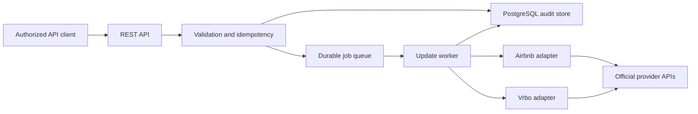

# Price Update Service — Proposal

> Adapter strategy update: see [Local Browser Adapter Proposal](./LOCAL_BROWSER_ADAPTER_PROPOSAL.md). That document proposes credential-local, isolated desktop adapters. Automated production interaction remains conditional on provider authorization because current Airbnb and Vrbo terms restrict automated access.
>
> Pricing extension: see [Price Engine Proposal](./PRICE_ENGINE_PROPOSAL.md) for human-readable seasonal, event, holiday, and length-of-stay rules with deterministic nightly calculations.
>
> Implementation: see [JavaScript Price Engine and Rule Service](./IMPLEMENTATION.md) for the browser/background engine package and runnable rule-file service.

## 1. Objective

Build a small, reliable REST service that accepts nightly price updates for a particular managed listing and date range, then publishes those prices to Airbnb and Vrbo. An optional provider-neutral price engine can generate those updates from approved, human-readable rules.

The update service remains a command-and-control layer: it validates, records, dispatches, retries, and reports the result for each channel. The separate price engine supplies desired nightly prices and provider-supported stay rules; callers may still submit explicit nightly prices without using it.

## 2. Important integration constraint

Direct production writes require approved provider connectivity:

- Airbnb makes API access and write scopes available through its API programs. Participation can require agreements, a security review, and implementation of mandatory features. Undocumented Airbnb endpoints must not be used. See [Airbnb API Terms](https://www.airbnb.com/help/article/3418) and [Airbnb channel-manager guidance](https://www.airbnb.com/help/article/3304).
- Vrbo supply connectivity is provided through Expedia Group's connectivity platform. Existing partners use credentials for APIs including Availability and Rates, and Vrbo supplier IDs require the appropriate Vrbo token. See [Expedia Group Connectivity documentation](https://developers.expediagroup.com/supply/lodging/docs/avail_and_rate_apis/promotions/getting_started/api_intro/) and its [Availability and Rates API change log](https://developers.expediagroup.com/supply/lodging/docs/avail_and_rate_apis/avail_rates/reference/release-notes/).

Therefore the recommended delivery path is:

1. Build and test the complete service using provider interfaces and sandbox/mock adapters.
2. Add the official Airbnb and Vrbo adapters when approved credentials and provider specifications are available.
3. Do not use browser automation, scraping, or undocumented private APIs for production price changes.

If the business already uses an approved property-management system or channel manager, integrating its API may be the fastest initial production adapter.

## 3. Proposed REST API

### Update prices

`POST /v1/price-updates`

Example request:

```json
{
  "listingId": "listing_123",
  "currency": "USD",
  "channels": ["airbnb", "vrbo"],
  "prices": [
    { "date": "2026-09-01", "amount": "225.00" },
    { "date": "2026-09-02", "amount": "240.00" }
  ],
  "idempotencyKey": "pricing-run-2026-09-01-v3"
}
```

Accepted response (`202 Accepted`):

```json
{
  "updateId": "pu_01K...",
  "status": "queued",
  "statusUrl": "/v1/price-updates/pu_01K..."
}
```

### Read status

`GET /v1/price-updates/{updateId}`

The response reports an overall status plus an independent result for every channel. A partial success is preserved rather than hidden.

### Optional convenience form

For one price across an inclusive date range, accept:

```json
{
  "listingId": "listing_123",
  "currency": "USD",
  "channels": ["airbnb", "vrbo"],
  "dateRange": {
    "start": "2026-09-01",
    "end": "2026-09-07",
    "amount": "225.00"
  },
  "idempotencyKey": "labor-day-week-v1"
}
```

Internally, the service expands this into nightly price records. Dates are listing-local calendar dates, not UTC timestamps.

## 4. Listing mapping

External provider IDs should not be accepted as the service's primary identity. Maintain a mapping such as:

| Internal listing | Channel | Provider listing ID | Currency | Time zone | Enabled |
|---|---|---|---|---|---|
| `listing_123` | Airbnb | provider-issued ID | USD | America/Los_Angeles | yes |
| `listing_123` | Vrbo | provider-issued ID | USD | America/Los_Angeles | yes |

This prevents callers from coupling themselves to provider identifiers and supports credential/account changes later.

## 5. Architecture



Recommended implementation:

- Stateless REST API and background worker.
- PostgreSQL for listings, mappings, update requests, per-channel attempts, and audit history.
- A durable queue. For a modest workload, a PostgreSQL-backed queue avoids adding infrastructure; adopt a managed queue later if volume warrants it.
- One adapter interface per channel, isolating authentication, payload translation, batching, throttling, and provider error handling.
- Secrets in a managed secret store, never in the database or logs.

## 6. Processing semantics

- Require an idempotency key and enforce uniqueness per client to make retries safe.
- Validate date format, nonnegative decimal amounts, currency, maximum horizon, maximum batch size, listing ownership, enabled mappings, and allowed channels before queueing.
- Store currency amounts as fixed-precision decimals or integer minor units; never use binary floating point.
- Track state per provider: `queued`, `processing`, `succeeded`, `retrying`, `failed`, or `unknown`.
- Retry only transient failures (timeouts, throttling, and provider 5xx responses) with exponential backoff and jitter.
- Do not automatically retry validation, authorization, unsupported-operation, or mapping errors.
- After an ambiguous timeout, reconcile or use provider-supported idempotency before resending; blind retries can produce uncertain state.
- Keep an immutable audit trail containing requested values, normalized values, actor, timestamps, adapter version, attempt count, and sanitized provider response.
- Support partial success. A successful Airbnb update must not be rolled back merely because Vrbo failed.

## 7. Security and operations

- Authenticate callers with OAuth 2.0 client credentials or signed service tokens; authorize by property-management account and listing.
- Require HTTPS, least-privilege provider credentials, key rotation, and encrypted storage.
- Redact access tokens and personal/provider-sensitive data from logs.
- Emit metrics for request count, queue age, provider latency, success rate, retry count, permanent failures, and credentials nearing expiration.
- Alert on repeated provider failures, sustained queue lag, and mismatches detected during reconciliation.
- Add a dry-run mode that performs validation and translation without publishing.
- Apply per-client and per-provider rate limits.

## 8. MVP scope

### Included

- REST endpoint, authentication, request validation, and OpenAPI specification.
- Internal listing-to-channel mapping.
- Durable asynchronous processing and idempotency.
- Mock Airbnb and Vrbo adapters with contract tests.
- Per-channel status endpoint and audit log.
- Retry policy, structured logging, metrics, and containerized deployment.
- Official adapters for every provider for which approved credentials and documentation are supplied.

### Deferred

- Predictive/ML revenue-management recommendations and automatic competitor reactions. The deterministic rule-based engine is specified separately in `PRICE_ENGINE_PROPOSAL.md`.
- Availability and reservation management, fees/taxes, and direct publishing of stay restrictions or promotions beyond what an approved adapter can reproduce exactly.
- UI/dashboard; the API and operational metrics are sufficient for the MVP.
- Multi-currency conversion.

## 9. Delivery stages

1. **Discovery and access:** confirm account ownership, provider/partner status, listing volume, existing PMS/channel manager, credentials, rate model, and sandbox availability.
2. **Service foundation:** implement API contract, database schema, idempotency, queue, mock adapters, audit, and tests.
3. **Provider integration:** implement each approved adapter, provider contract tests, throttling, and sandbox certification.
4. **Pilot:** enable a small set of listings, use dry runs, publish limited future dates, and manually verify provider calendars.
5. **Production:** staged rollout, alerting, runbooks, credential rotation, reconciliation, and service-level objectives.

## 10. Acceptance criteria

- A valid request returns an update ID without waiting for provider calls.
- Repeating the same idempotency key does not create a second logical update.
- Every requested listing/date/channel has a traceable terminal or explicitly unknown state.
- Transient errors retry within policy; permanent errors are surfaced with actionable codes.
- One provider can succeed while the other fails, and the status response represents both accurately.
- Unauthorized clients cannot view or change another account's listings.
- No secret appears in application logs, API responses, or audit records.
- Pilot price changes are verified in both channel calendars for approved test listings.

## 11. Decisions needed before implementation

1. Are approved Airbnb and Vrbo connectivity credentials already available?
2. Is there an existing PMS or channel manager that already controls these listings?
3. Should an update replace existing prices for the supplied dates unconditionally, or require an expected-current-value check?
4. What are the expected number of listings, nightly updates, users/clients, and acceptable propagation time?
5. Is the service single-company or multi-tenant?
6. Which cloud/runtime and programming language are preferred?

## Recommendation

Proceed with the provider-neutral service foundation immediately, but treat official provider access as the first project risk. If direct partner access is not already in place, prioritize an adapter to the existing approved PMS/channel manager; it is likely the shortest compliant path to updating both Airbnb and Vrbo.
